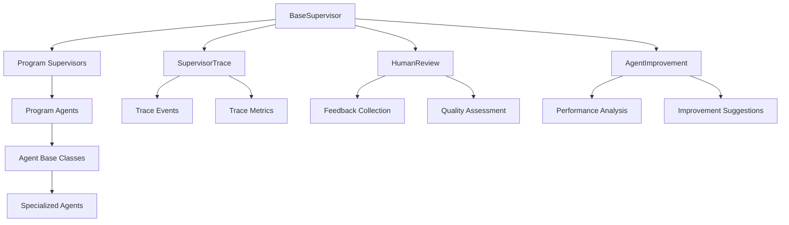
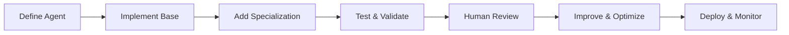

# Agent Framework Architecture

## Core Objectives

1. **Reusable Agent Structure**
   - Common base classes and interfaces
   - Standardized agent communication
   - Consistent error handling
   - Shared tracing capabilities

2. **Supervisor System**
   - Centralized agent coordination
   - Task distribution and monitoring
   - Error recovery and retry logic
   - Performance optimization

3. **Human Review Integration**
   - Feedback collection
   - Quality assessment
   - Improvement suggestions
   - Learning from human input

4. **Agent Improvement System**
   - Performance metrics collection
   - Behavior analysis
   - Automated improvement suggestions
   - Learning from past interactions

## Architecture Overview



## Core Components

### 1. Base Supervisor
- Manages agent lifecycle
- Coordinates agent interactions
- Handles task distribution
- Monitors system health

### 2. SupervisorTrace
- Tracks agent interactions
- Records system events
- Collects performance metrics
- Enables debugging and analysis

### 3. Human Review System
- Collects human feedback
- Assesses agent performance
- Provides improvement suggestions
- Enables continuous learning

### 4. Agent Improvement System
- Analyzes agent behavior
- Identifies improvement areas
- Suggests optimizations
- Tracks learning progress

## Agent Development Flow



## Implementation Guidelines

### 1. Agent Development
```python
class BaseAgent:
    """Base class for all agents."""
    
    def __init__(self, config: Dict[str, Any]):
        self.config = config
        self.performance_metrics = {}
        self.learning_history = []
        
    async def process(self, task: Dict[str, Any]) -> Dict[str, Any]:
        """Process a task and collect metrics."""
        start_time = time.time()
        try:
            result = await self._process_internal(task)
            self._update_metrics("success", time.time() - start_time)
            return result
        except Exception as e:
            self._update_metrics("error", time.time() - start_time)
            raise
            
    def get_improvement_suggestions(self) -> List[Dict[str, Any]]:
        """Get suggestions for improvement based on metrics."""
        return self._analyze_performance()
```

### 2. Human Review Integration
```python
class HumanReview:
    """Handles human feedback and review."""
    
    def collect_feedback(self, agent: BaseAgent, task: Dict[str, Any]) -> Dict[str, Any]:
        """Collect human feedback for agent performance."""
        feedback = self._get_human_input()
        self._store_feedback(agent, task, feedback)
        return feedback
        
    def analyze_quality(self, agent: BaseAgent) -> Dict[str, Any]:
        """Analyze agent quality based on feedback."""
        return self._calculate_quality_metrics(agent)
```

### 3. Agent Improvement
```python
class AgentImprovement:
    """Manages agent improvement and learning."""
    
    def analyze_performance(self, agent: BaseAgent) -> Dict[str, Any]:
        """Analyze agent performance metrics."""
        metrics = agent.get_performance_metrics()
        return self._generate_improvement_suggestions(metrics)
        
    def apply_improvements(self, agent: BaseAgent, suggestions: List[Dict[str, Any]]) -> None:
        """Apply suggested improvements to agent."""
        for suggestion in suggestions:
            agent.apply_improvement(suggestion)
```

## Best Practices

### 1. Agent Development
- Follow the base class structure
- Implement required interfaces
- Add proper error handling
- Include performance metrics

### 2. Human Review
- Collect comprehensive feedback
- Store feedback with context
- Analyze feedback patterns
- Use feedback for improvement

### 3. Performance Monitoring
- Track key metrics
- Monitor error rates
- Measure response times
- Analyze interaction patterns

### 4. Improvement Process
- Regular performance analysis
- Continuous learning
- Incremental improvements
- Validation of changes

## Example Usage

### 1. Creating a New Agent
```python
class MySpecializedAgent(BaseAgent):
    """A specialized agent implementation."""
    
    async def _process_internal(self, task: Dict[str, Any]) -> Dict[str, Any]:
        # Implement specialized processing
        result = await self._specialized_processing(task)
        
        # Collect metrics
        self._update_metrics("specialized_operation", time.time() - start_time)
        
        return result
```

### 2. Using Human Review
```python
async def process_with_review(task: Dict[str, Any]) -> Dict[str, Any]:
    # Process task
    result = await agent.process(task)
    
    # Get human review
    feedback = human_review.collect_feedback(agent, task)
    
    # Apply improvements
    if feedback["needs_improvement"]:
        suggestions = agent_improvement.analyze_performance(agent)
        agent_improvement.apply_improvements(agent, suggestions)
    
    return result
```

### 3. Monitoring and Improvement
```python
async def monitor_and_improve():
    # Get performance metrics
    metrics = agent.get_performance_metrics()
    
    # Analyze performance
    analysis = agent_improvement.analyze_performance(agent)
    
    # Get improvement suggestions
    suggestions = analysis["suggestions"]
    
    # Apply improvements
    agent_improvement.apply_improvements(agent, suggestions)
    
    # Validate improvements
    new_metrics = agent.get_performance_metrics()
    improvement = compare_metrics(metrics, new_metrics)
```

## Future Enhancements

1. **Advanced Learning**
   - Machine learning integration
   - Automated optimization
   - Pattern recognition
   - Predictive improvements

2. **Enhanced Monitoring**
   - Real-time metrics
   - Predictive analytics
   - Automated alerts
   - Performance forecasting

3. **Improved Human Review**
   - Automated feedback collection
   - Quality scoring
   - Trend analysis
   - Improvement prioritization

4. **System Integration**
   - API endpoints
   - Web interface
   - Monitoring dashboard
   - Analytics tools 