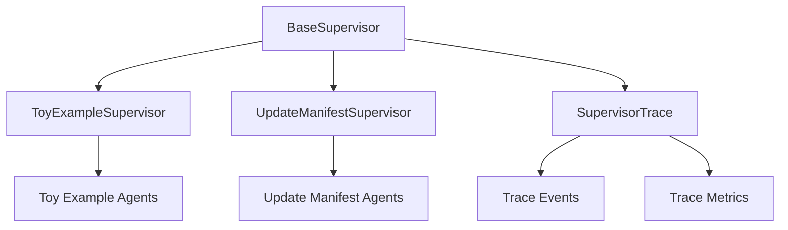

# Supervisor in Practice

## Overview
This guide explains how to use the supervisor system in practice, including how to create new programs, customize supervisors, and work with the tracing system.

## Architecture



## Creating a New Program

### 1. Create a New Supervisor Class
```python
from typing import Dict, Any
from .base_supervisor import BaseSupervisor

class MyProgramSupervisor(BaseSupervisor):
    """Supervisor for my custom program."""
    
    def __init__(self, config: Dict[str, Any]):
        super().__init__(config)
        
    async def _create_agent(self, name: str, config: Dict[str, Any]) -> Any:
        """Create program-specific agents."""
        if name == "custom_agent":
            from .custom_agent import CustomAgent
            return CustomAgent(config)
        else:
            return await super()._create_agent(name, config)
            
    def _task_to_message(self, task: Dict[str, Any]) -> str:
        """Add program-specific context to messages."""
        base_message = super()._task_to_message(task)
        if task.get("type") == "custom_task":
            base_message += f"\nCustom Context: {task.get('metadata', {}).get('context', 'unknown')}"
        return base_message
```

### 2. Configure the Program
```json
{
    "my_program": {
        "agents": {
            "custom_agent": {
                "name": "custom_agent",
                "system_message": "I am a custom agent",
                "llm_config": {
                    "model": "gpt-4",
                    "temperature": 0.7
                }
            }
        },
        "supervisor": {
            "max_retries": 3,
            "retry_delay": 1,
            "timeout": 30
        }
    }
}
```

### 3. Use the Supervisor
```python
async def main():
    # Load configuration
    config = load_config("global_config.json")
    
    # Create supervisor
    supervisor = MyProgramSupervisor(config["my_program"])
    
    # Initialize and start
    await supervisor.start()
    
    # Process tasks
    task = {
        "type": "custom_task",
        "content": "Process this task",
        "metadata": {
            "context": "custom context"
        }
    }
    
    result = await supervisor.process_task(task)
    
    # Get trace information
    trace = supervisor.get_trace(task["id"])
    metrics = supervisor.get_trace_metrics()
    
    # Stop supervisor
    await supervisor.stop()
```

## Working with Traces

### 1. Accessing Trace Information
```python
# Get specific trace
trace = supervisor.get_trace("task_123")

# Get all traces
all_traces = supervisor.get_all_traces()

# Get metrics
metrics = supervisor.get_trace_metrics()

# Clear traces
supervisor.clear_traces()
```

### 2. Analyzing Traces
```python
def analyze_traces(traces: List[Dict[str, Any]]) -> Dict[str, Any]:
    """Analyze trace data for insights."""
    analysis = {
        "total_tasks": len(traces),
        "success_rate": 0,
        "average_duration": 0,
        "error_types": {},
        "agent_interactions": {}
    }
    
    for trace in traces:
        # Calculate success rate
        if trace["status"] == "completed":
            analysis["success_rate"] += 1
            
        # Calculate duration
        start = datetime.fromisoformat(trace["start_time"])
        end = datetime.fromisoformat(trace["end_time"])
        duration = (end - start).total_seconds()
        analysis["average_duration"] += duration
        
        # Count error types
        for event in trace["events"]:
            if event["type"] == "error":
                error_type = event["error_type"]
                analysis["error_types"][error_type] = analysis["error_types"].get(error_type, 0) + 1
                
        # Count agent interactions
        for interaction in trace["agent_interactions"]:
            sender = interaction["sender"]
            recipient = interaction["recipient"]
            key = f"{sender}->{recipient}"
            analysis["agent_interactions"][key] = analysis["agent_interactions"].get(key, 0) + 1
            
    # Calculate averages
    analysis["success_rate"] /= len(traces)
    analysis["average_duration"] /= len(traces)
    
    return analysis
```

## Best Practices

### 1. Supervisor Configuration
- Keep program-specific configuration separate
- Use meaningful agent names
- Configure appropriate timeouts and retries
- Set up proper error handling

### 2. Agent Creation
- Inherit from appropriate base classes
- Implement required interfaces
- Handle errors gracefully
- Log important events

### 3. Task Processing
- Validate task format
- Add appropriate context
- Handle errors properly
- Trace important events

### 4. Trace Management
- Set appropriate trace levels
- Configure trace retention
- Monitor trace storage
- Analyze trace data regularly

## Common Patterns

### 1. Error Handling
```python
async def process_task(self, task: Dict[str, Any]) -> Dict[str, Any]:
    try:
        self.trace.start_trace(task)
        result = await self._process_task_internal(task)
        self.trace.end_trace(result)
        return result
    except Exception as e:
        self.trace.trace_error(e, {"task": task})
        raise
```

### 2. Agent Interaction
```python
async def _process_task_internal(self, task: Dict[str, Any]) -> Dict[str, Any]:
    # Convert task to message
    message = self._task_to_message(task)
    
    # Process through group chat
    result = await self.group_chat_manager.run(message)
    
    # Trace interaction
    self.trace.trace_agent_interaction(
        self.agents["sender"],
        self.agents["recipient"],
        message
    )
    
    return self._message_to_task(result)
```

### 3. Decision Making
```python
async def handle_error(self, error: Exception, context: Dict[str, Any]) -> None:
    self.trace.trace_decision("error_handling", {
        "error": str(error),
        "context": context
    })
    
    if self.error_count > self.max_retries:
        self.trace.trace_decision("max_retries_exceeded", {
            "error": str(error)
        })
        raise error
        
    await self._retry_operation(context)
```

## Troubleshooting

### 1. Common Issues
- **Task Processing Fails**
  - Check task format
  - Verify agent configuration
  - Review error traces
  
- **Agent Creation Fails**
  - Verify agent class exists
  - Check configuration
  - Review dependencies
  
- **Trace Issues**
  - Check trace level
  - Verify trace configuration
  - Monitor trace storage

### 2. Debugging
```python
# Enable debug logging
config["tracing"]["level"] = "DEBUG"

# Get detailed trace
trace = supervisor.get_trace("task_123")
print(json.dumps(trace, indent=2))

# Check metrics
metrics = supervisor.get_trace_metrics()
print(json.dumps(metrics, indent=2))
```

## Performance Considerations

### 1. Memory Usage
- Monitor trace storage
- Clear old traces
- Use appropriate trace levels
- Configure trace retention

### 2. Processing Speed
- Optimize agent creation
- Minimize trace overhead
- Use appropriate timeouts
- Configure retry delays

### 3. Storage
- Configure trace persistence
- Set appropriate retention
- Monitor disk usage
- Clean up old traces 