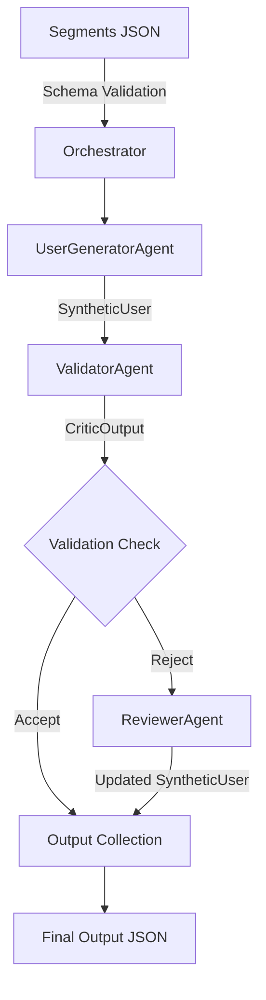

# Synthetic User Generation System: Architecture Overview

## Purpose and Goals
This system generates synthetic users for market segments using a multi-agent, traceable workflow. The goals are:
- High-quality, realistic synthetic user data
- Full traceability and auditability of all actions
- Easy extensibility and testability
- Robust configuration and state management

## Architecture Overview

The synthetic user generation system follows a modular, agent-based architecture with strict type validation and structured outputs. The system consists of the following key components:

### Core Components

1. **Orchestrator**
   - Coordinates the entire synthetic user generation workflow
   - Manages agent interactions and data flow
   - Handles input/output file operations
   - Validates segment schema at runtime
   - Maintains tracing and logging

2. **Pydantic Models**
   - `SyntheticUser`: Strict type validation for user data
   - `CriticOutput`: Structured validation results
   - Located in `tradeshow/src/pydantic_schema.py`

3. **Schema Validation**
   - Runtime validation of segments.json against segments_schema.json
   - Pre-execution validation to ensure data integrity
   - Halts execution with clear error messages if validation fails

### Agents

1. **UserGeneratorAgent**
   - Generates synthetic users based on segment data
   - Returns structured `SyntheticUser` Pydantic model
   - Uses OpenAI GPT-4 with response format validation
   - Maintains sequential user ID generation

2. **ValidatorAgent**
   - Validates synthetic users for realism and consistency
   - Returns structured `CriticOutput` Pydantic model
   - Provides detailed validation metrics and recommendations

3. **ReviewerAgent**
   - Reviews and improves rejected synthetic users
   - Returns updated `SyntheticUser` model
   - Incorporates validator feedback for improvements

### Data Flow



### Tracing and Logging

- Comprehensive tracing through `TracedGroupChat`
- Logs all agent activities, LLM interactions, and data transformations
- Maintains context for debugging and analysis

### Configuration

- Agent configurations in `config_agents.json`
- System configurations in `config.json`
- Agent state management in `config_agents_state.json`
- Updated agent descriptions and system messages in `agents_update.json`

### Input/Output

- Input: Segments data with schema validation
- Output: Collection of validated synthetic users
- Intermediate: Validation reports and improvement suggestions
- Tracing: Detailed logs of the entire generation process

### Error Handling

- Schema validation errors halt execution
- Pydantic validation ensures type safety
- Clear error messages for debugging
- Graceful handling of LLM failures

This architecture ensures type safety, data validation, and maintainable code while providing comprehensive tracing for debugging and analysis.

## High-Level Workflow
1. Load configuration, agent settings, and state
2. For each segment, generate the configured number of users (one per call)
3. Validate each user against the schema
4. Review and correct users if validation fails
5. Log all actions and save outputs

## Agent Roles
- **UserGeneratorAgent:** Generates a realistic individual synthetic user profile for a randomly chosen Brazilian financial segment, ensuring internal consistency, plausibility, and clear segment alignment. Returns a strictly-typed `SyntheticUser` Pydantic model. **Temperature:** 0.7
- **ValidatorAgent:** Evaluates a single synthetic user profile for realism, internal consistency, and fidelity to its stated Brazilian financial segment. Returns a strictly-typed `CriticOutput` Pydantic model. **Temperature:** 0.0
- **ReviewerAgent:** Reviews and quality-assures synthetic user profiles using the segment definition and critic feedback, ensuring realism, coherence, and alignment. Returns a dict with an `update_synthetic_user` field containing a strictly-typed `SyntheticUser` Pydantic model. **Temperature:** 0.2
- **TracedGroupChat:** Logs all actions/messages for auditability
- **Orchestrator:** Coordinates the workflow

## Model Temperature Rationale

| Agent     | Temperature | Rationale                                                                 |
|-----------|-------------|--------------------------------------------------------------------------|
| Generator | 0.7         | Balances creativity and coherence, producing varied yet plausible profiles.|
| Critic    | 0.0         | Ensures deterministic, focused analysis with minimal randomness.           |
| Reviewer  | 0.2         | Allows slight natural variation for precise rewriting while maintaining fidelity. |

See `docs/model_temperatures.md` for more details.

## Structured Outputs and Validation
- All agent outputs are now structured using Pydantic models that exactly match the JSON schemas in `tradeshow/schema/`.
- The `UserGeneratorAgent` outputs a `SyntheticUser` model.
- The `ValidatorAgent` outputs a `CriticOutput` model.
- The `ReviewerAgent` returns an `update_synthetic_user` field using the `SyntheticUser` model.
- At runtime, the segments definition file (`input/segments.json`) is validated against the schema in `schema/segmets_schema.json` before any processing begins. If validation fails, the program halts with a clear error message.

## Configuration and State Management
- **config.json:** Main workflow configuration (input/output paths, users per segment, etc.)
- **config_agents.json:** Agent-specific configuration (user_id field, temperature, descriptions, system messages)
- **config_agents_state.json:** Tracks the last used user_id for sequential assignment

## Folder Structure
```
tradeshow/
  config.json
  config_agents.json
  config_agents_state.json
  input/
    segments.json
    synthetic_user_schema.json
  output/
    synthetic_users.json
  logs/
    trace_run.json
  docs/
    ... (markdown docs)
  tests/
    test_synthetic_user_generation.py
  src/
    synthetic_user_generator.py
```

## Extensibility and Testability
- Modular agent classes for easy extension
- All configuration and state externalized in JSON
- Tests use static/mock logic for reproducibility
- System can be adapted for new schemas, segments, or agent logic

---
See other docs in `tradeshow/docs/` for details on workflow, agent configuration, and usage. 